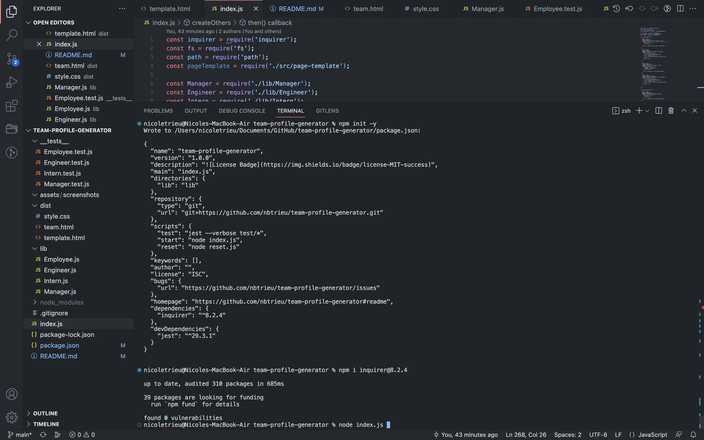
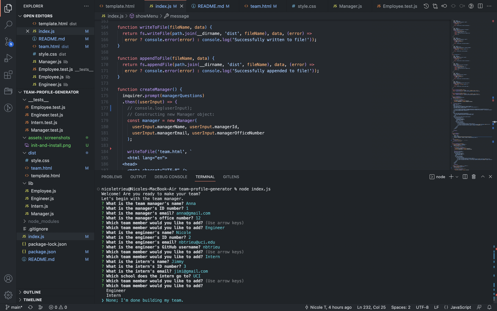
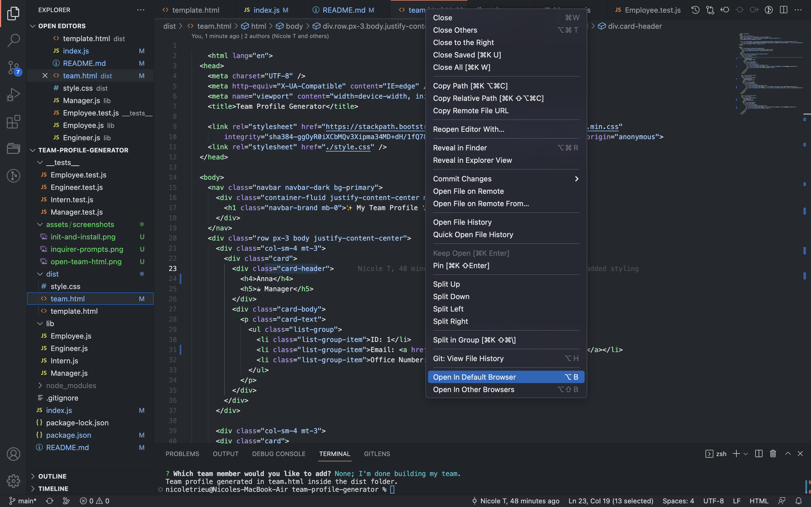
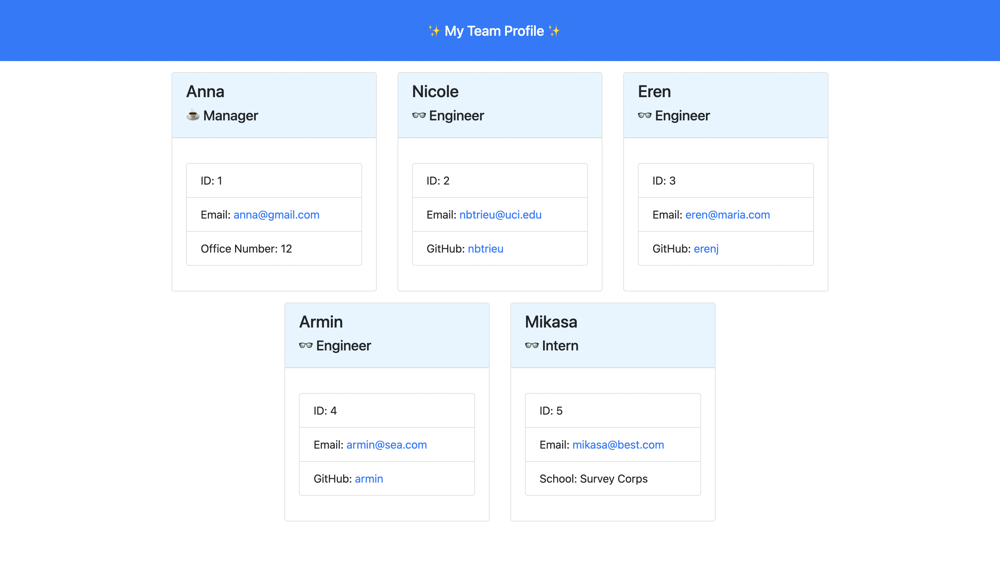

# Team Profile Generator

## Description

This Node.js command-line application is built to accept information about employees on a software engineering team and dynamically generate an HTML webpage that displays summaries for each team member.

## Table of Content

* [Installation](#installation)

* [Usage](#usage)

* [License](#license)

* [Contributing](#contributing)

* [Tests](#tests)

* [Questions](#questions)   

## Installation

To install all necessary dependencies, please run the command below:
``npm i inquirer@8.2.4``

## Usage

To use this application, simply initialize the npm and install the inquirer package (as instructed above). Then, run node index.js and answer the prompts in the command line interface.
 

  

  

[To learn more, watch the walkthrough video here.]()

## License
    
Licensed under the MIT license.    

## Contributing

There are many ways in which you can participate in this project.
Users can contribute to this repo by submitting bugs and feature requests, reviewing source code changes, and making pull requests for any issues they can find.   

## Tests

To run tests, please run the command below:  

``npm i --save-dev jest``        
``npm test``    

## Questions

For any questions or feedback, please feel free to email me at nbtrieu@uci.edu.
If you would like to check out more of my projects, please visit [nbtrieu](https://github.com/nbtrieu).

